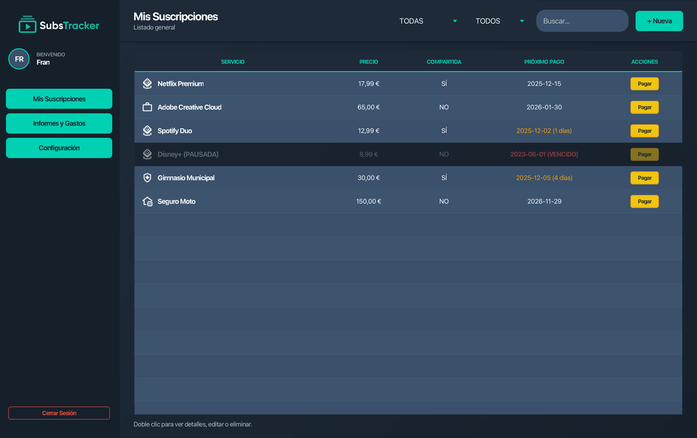
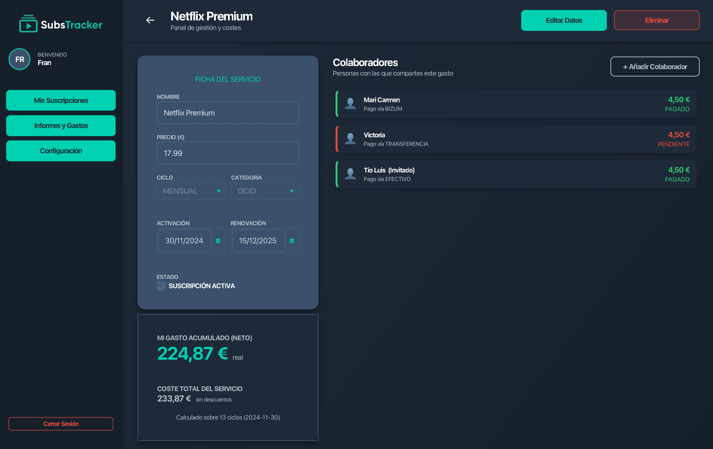
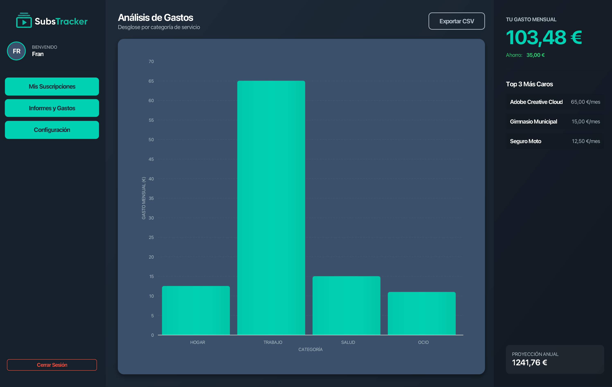
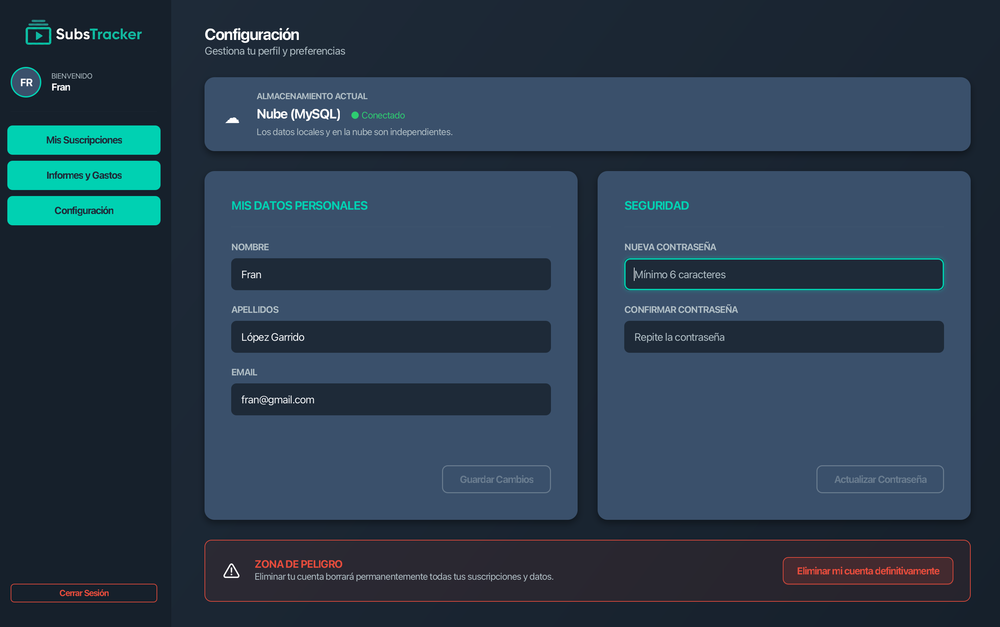
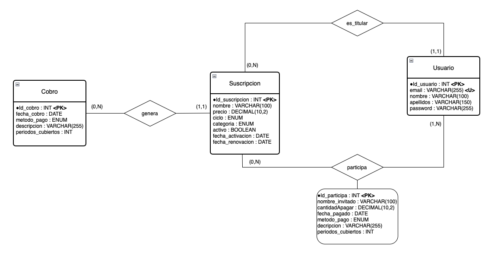
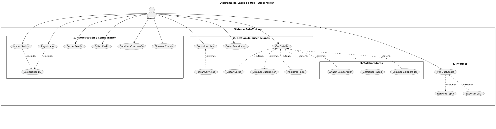

Markdown


> **Tu vida digital, bajo control.** > Gestiona tus suscripciones, controla tus gastos mensuales y lleva la cuenta de los pagos compartidos con amigos y familiares de forma sencilla y elegante.


---

##  Descripción

**SubsTracker** es una aplicación de escritorio diseñada para solucionar el caos de las suscripciones modernas (Netflix, Spotify, Adobe, gimnasio, seguros...).

A diferencia de otras apps de finanzas genéricas, **SubsTracker** se especializa en la gestión de **servicios recurrentes**, permitiendo no solo listar lo que pagas, sino gestionar **cuentas compartidas** (cálculo de deudas y pagos de amigos), visualizar el estado de los pagos en tiempo real y obtener proyecciones financieras anuales.

La aplicación destaca por su **arquitectura híbrida**, permitiendo al usuario elegir entre trabajar en la nube (**MySQL**) o en modo local/offline (**SQLite**) sin configuraciones complejas.

---

##  Características Principales

###  Seguridad y Acceso
* **Autenticación Robusta:** Login y Registro de usuarios propios.
* **Cifrado:** Las contraseñas nunca se guardan en texto plano; se utiliza **BCrypt** para un hashing seguro.
* **Persistencia Dual:** Selector de base de datos al iniciar sesión (Nube vs Local).

###  Gestión de Suscripciones
* **CRUD Completo:** Altas, bajas y modificaciones de servicios.
* **Ciclos de Pago:** Soporte para pagos Mensuales, Trimestrales y Anuales.
* **Alertas Visuales:** La tabla principal avisa con códigos de color:
    * 🟢 **Blanco:** Pago futuro lejano.
    * 🟠 **Naranja:** Vence en menos de 7 días.
    * 🟡 **Dorado:** ¡Se paga hoy!
    * 🔴 **Rojo:** Vencido/Impagado.

###  Gestión de Colaboradores (Funcionalidad Estrella)
* **Cuentas Compartidas:** Registra a otras personas que pagan una parte de tu suscripción.
* **Invitados:** Añade colaboradores sin necesidad de que tengan cuenta en la app (ej. "Mamá", "Compañero de piso").
* **Control de Deudas:** Marca visualmente si un colaborador ha pagado su parte del ciclo actual (Verde) o si debe dinero (Rojo).
* **Adelantos:** El sistema reconoce pagos por adelantado (ej. alguien paga 6 meses de golpe) y mantiene el estado "Pagado" correctamente durante ese tiempo.

###  Informes y Análisis
* **Dashboard Financiero:** Vista general con KPIs (Gasto Mensual Neto, Ahorro total, Proyección Anual).
* **Gráficos:** Visualización de gastos por categoría (Ocio, Hogar, Trabajo, Salud, Educación).
* **Ranking:** Top 3 de los servicios que más impactan en tu bolsillo.
* **Exportación:** Generación de informes en formato **CSV** compatibles con Excel.

---

##  Galería de Capturas

### 1. Dashboard Principal
*Vista clara de todas las suscripciones con alertas de pago inteligentes y filtrado en tiempo real.*


### 2. Detalle de Suscripción
*Panel dividido: Ficha técnica a la izquierda y gestión de colaboradores a la derecha.*


### 3. Informes Financieros
*Análisis visual de los gastos, desglose por categorías y proyección anual.*


### 4. Configuración y Seguridad
*Gestión de perfil con validaciones en tiempo real y zona de peligro.*


---

##  Stack Tecnológico

| Categoría | Tecnología | Descripción |
| :--- | :--- | :--- |
| **Lenguaje** | Java 23 | Lógica de negocio y backend. |
| **UI Framework** | JavaFX 21 | Interfaz gráfica moderna basada en FXML. |
| **Estilos** | CSS3 | Diseño "Dark Mode" personalizado (`style.css`). |
| **Persistencia** | JDBC | Conexión directa y optimizada a bases de datos. |
| **Base de Datos 1** | MySQL 8 | Para almacenamiento remoto/servidor. |
| **Base de Datos 2** | SQLite | Para almacenamiento local embebido (archivo `.db`). |
| **Seguridad** | JBCrypt | Librería para hashing seguro de contraseñas. |
| **Gestión** | Maven | Gestión de dependencias y ciclo de vida del proyecto. |

---

##  Arquitectura y Diseño

El proyecto sigue estrictamente el patrón de diseño **MVC (Modelo-Vista-Controlador)** junto con el patrón **DAO (Data Access Object)** para la capa de persistencia, garantizando un código limpio, modular y mantenible.

### Diagrama Entidad-Relación (E-R)
*Estructura de la base de datos, mostrando la relación entre Usuarios, Suscripciones, Cobros y la entidad asociativa Participa.*



### Diagrama de Clases (UML)
*Relación entre los Controladores de la UI, los Modelos de datos y la capa DAO.*


### Diagrama de Casos de Uso
*Visualización de las interacciones del usuario con el sistema, organizadas por módulos funcionales.*



---

##  Instalación y Uso

### Requisitos
* JDK 21 o superior.
* Maven instalado.

### Pasos para ejecutar
1.  **Clonar el repositorio:**
    ```bash
    git clone [https://github.com/frangc2510/SubsTracker.git](https://github.com/frangc2510/SubsTracker.git)
    cd SubsTracker
    ```
2.  **Compilar y ejecutar:**
    ```bash
    mvn clean javafx:run
    ```

### Configuración de Base de Datos
La aplicación pregunta al iniciar qué base de datos usar:
* **Local (SQLite):** No requiere configuración. La app creará automáticamente una carpeta `data` en la raíz del proyecto.
* **Nube (MySQL):** Requiere un servidor MySQL corriendo. Configura las credenciales en el archivo:
  `src/main/resources/configDB/database_mysql.properties`

---

##  Autor

**Fco Javier García Cañero**
* Desarrollador Full Stack Java.
* [GitHub](https://github.com/frangc2510)

---